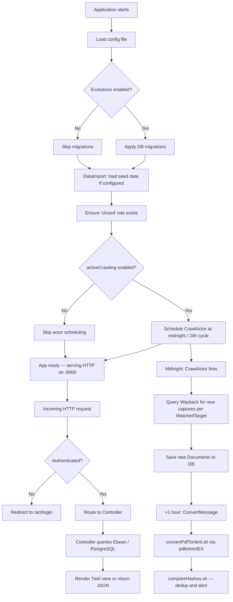

# Runtime Flow

## Starting the Application

### Development

```
activator run
# or
activator -Dconfig.file=conf/dev-on-docker.conf -Dlogger.file=conf/logger-debug.xml clean start
```

The app is then accessible at `http://localhost:9000/act/`.

### Production (Docker)

```
docker-compose up w3act
```

The container runs:

```
/w3act/bin/w3act -J-Xmx4g -J-XX:+ExitOnOutOfMemoryError \
  -Dconfig.file=/w3act/conf/docker.conf \
  -Dpidfile.path=/dev/null
```

### Non-Docker Production

```
play clean stage
# then run the generated target/universal/stage/bin/w3act script
```

---

## Startup Sequence

When the Play application starts, `app/Global.java` (`onStart`) runs in this order:

1. **Config loading** — the active config file is loaded (default: `application.conf`; overridden by the `-Dconfig.file` JVM flag).

2. **Database schema** — if evolutions are enabled, Play applies any pending SQL migrations from `conf/evolutions/default/` before accepting requests.

3. **Seed data import** — if `application.data.import=true`, `DataImport.INSTANCE.insert()` populates the database with fixture data from `conf/testdata-*.yml`. This covers roles, organisations, users, targets, collections, and subjects.

4. **Role check** — the app ensures a `closed` role exists in the database (used to disable user accounts).

5. **CrawlActor scheduling** — if `application.activeCrawling=true`, an Akka actor (`CrawlActor`) is scheduled to fire at the next midnight and then every 24 hours thereafter.

---

## Request Handling

Once running, the application handles requests as follows:

- All routes are defined in `conf/routes` and dispatched by Play's router.
- Most routes require authentication. `SecuredController` checks for an `email` key in the session. Unauthenticated requests are redirected to the login page.
- The `/act/api/` routes serve JSON responses and accept `PUT` updates; they use the same session-cookie auth.
- The `/ukwa/licenseform/:token` route is **unauthenticated** — it serves the licence acceptance form to external site owners via a one-time token.

---

## Background Processing

After startup, the **CrawlActor** runs on a nightly schedule:

1. Retrieves all WatchedTargets from the database.
2. For each WatchedTarget, queries Wayback for captures newer than the last known timestamp.
3. Saves newly discovered Documents to the database.
4. One hour after the crawl phase, a `ConvertMessage` triggers PDF-to-HTML conversion for all documents lacking a SHA-256 hash.
5. Conversion uses the shell script `conf/converter/convertPdfToHtml.sh` (calls pdftohtmlEX).
6. After conversion, `compareHashes.sh` deduplicates documents and raises alerts for duplicates.

---

## Runtime Flow Diagram


