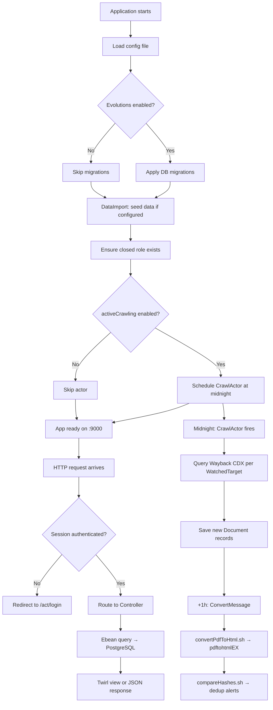
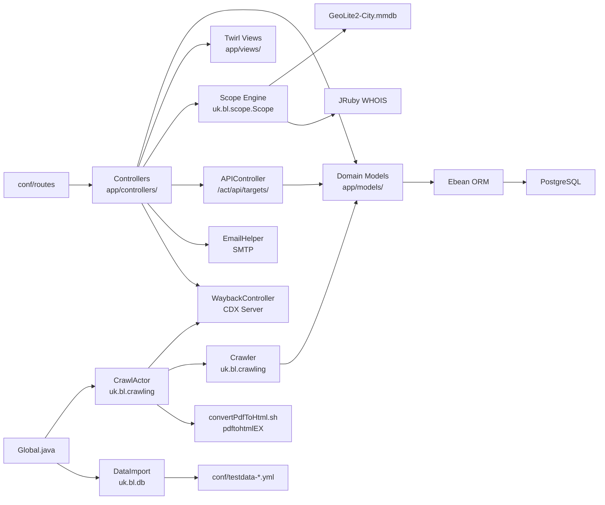
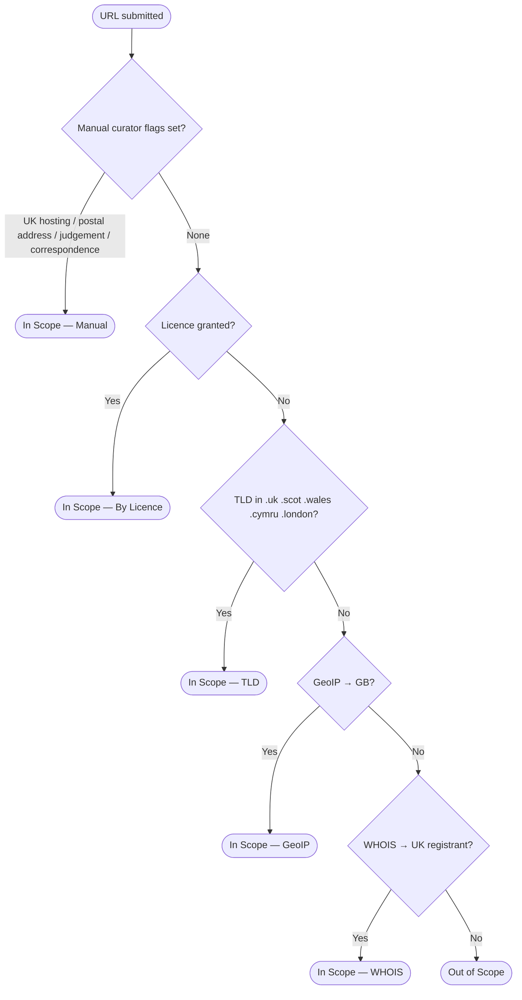

# Diagrams

## 1. Runtime Flow



---

## 2. Module and File Interaction



---

## 3. Sequence Diagram — Crawl Licence Request Workflow

This is the most complex multi-party behaviour in the system.

```mermaid
sequenceDiagram
    participant A as Archivist
    participant W as W3ACT UI
    participant DB as PostgreSQL
    participant M as SMTP Mail Server
    participant O as Site Owner

    A->>W: Open CrawlPermission form for Target
    W->>DB: Load Target, ContactPerson, MailTemplates
    DB-->>W: Return data
    A->>W: Select ContactPerson, MailTemplate, Licence; submit
    W->>DB: Create CrawlPermission record (status=pending)
    W->>M: Send email to ContactPerson with token URL
    M-->>O: Email delivered

    O->>W: Visit /act/ukwa/licenseform/:token (unauthenticated)
    W->>DB: Look up CrawlPermission by token
    DB-->>W: Return CrawlPermission + Licence terms
    W-->>O: Render licence form

    O->>W: Accept licence (submit form)
    W->>DB: Update CrawlPermission status = agreed
    W->>DB: Update Target licence status
    W-->>O: Show confirmation page

    A->>W: View Target — licence now shown as agreed
```

---

## 4. Scope Determination Flow

How the system decides whether a Target URL is in legal-deposit scope.


